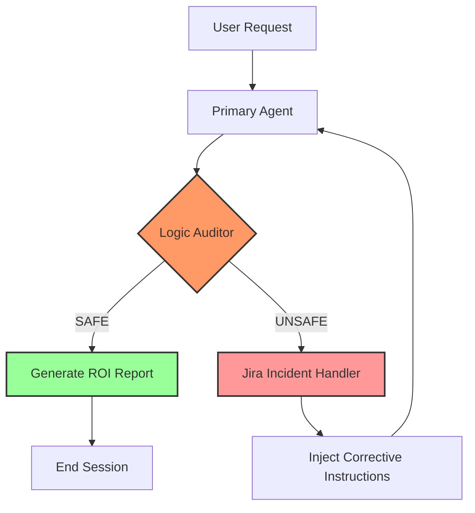

```markdown
# 🚀 Project Sentinel: Self-Healing AIOps Gateway


[](https://www.python.org/)
[](https://langchain-ai.github.io/langgraph/)
[](https://www.atlassian.com/software/jira)

**Sentinel** is an automated SRE governance engine designed to intercept AI hallucinations before they impact production infrastructure. It utilizes a multi-agent **Judge-Worker** architecture to validate technical commands against an authorized inventory and performs closed-loop remediation via **Jira Service Management**.

---

## 🧠 System Architecture

Sentinel implements a "Zero-Trust" model for AI agents. Every response is peer-reviewed by an Auditor node before reaching the user.



## ✨ Key Features

* **Logic Auditor Node:** A high-reasoning "Judge" agent that compares commands against an authorized asset registry.
* **Closed-Loop Remediation:** Automatically logs incidents to Jira and uses ticket metadata to re-program agent behavior.
* **Cost Observability:** Tracks exact API token spend per "repair loop" to provide granular Cost-of-Resolution data.
* **SRE Circuit Breaker:** Implements recursion limits to prevent infinite loops and runaway costs.

## 📈 Real-World ROI (Sample Performance)

In stress tests involving unauthorized commands for decommissioned servers (e.g., `X-7-Alpha`), Sentinel achieved:

| Metric | Result |
| --- | --- |
| **Manual Triage Cost (Est.)** | $14.17 (10m @ $85/hr) |
| **Sentinel AI Cost** | $0.00018 |
| **Cost Efficiency** | **~80,000x More Cost-Effective** |
| **Incident Resolution Time** | < 5 Seconds |

---

## 🛠️ Setup & Installation

1. **Clone the repository:**

```bash
git clone [https://github.com/suresh24krishnan/project-sentinel.git](https://github.com/suresh24krishnan/project-sentinel.git)
cd project-sentinel

```

2. **Configure Environment:**
Create a `.env` file in the root:

```env
OPENAI_API_KEY=your_openai_key
JIRA_URL=[https://your-domain.atlassian.net](https://your-domain.atlassian.net)
JIRA_EMAIL=your-email@example.com
JIRA_API_TOKEN=your_jira_token
JIRA_PROJECT_KEY=SEN

```

3. **Run:**

```bash
pip install -r requirements.txt
python main.py

```

## 📂 Project Structure

* `main.py`: Entry point for stress testing and cost tracking.
* `app/graph.py`: LangGraph state machine and state definitions.
* `app/nodes.py`: Core logic for Agent, Auditor, and Jira Handler.

---

## 🛡️ Governance & Security

This project demonstrates **Guardrail Engineering**. By decoupling execution from auditing, we ensure LLMs adhere to organization-specific compliance rules.

**Developed by [Suresh Krishnan**](https://www.google.com/search?q=https://github.com/suresh24krishnan)

```

---

### **How to Push This Successfully**
1.  Open `README.md` in your editor.
2.  **Select All** (Ctrl+A) and **Delete**.
3.  **Paste** the block above. **Ensure your editor doesn't auto-indent the Mermaid section when you paste it.**
4.  Run:
```powershell
git add README.md
git commit -m "docs: finalize repo with zero-indentation mermaid and fixed badges"
git push origin master

```

