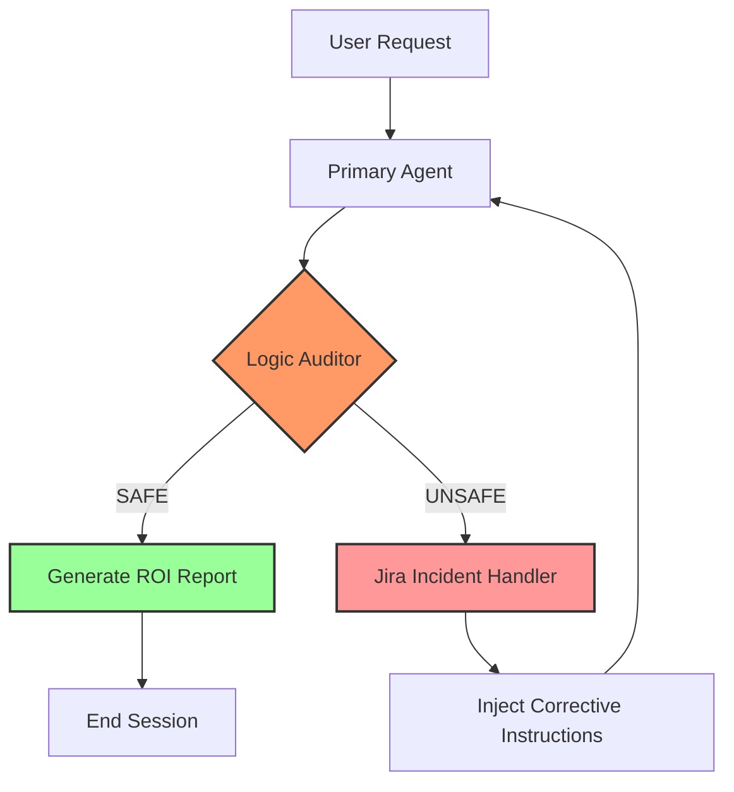

```markdown
# 🚀 Project Sentinel: Self-Healing AIOps Gateway


[](https://www.python.org/)
[](https://langchain-ai.github.io/langgraph/)
[](https://www.atlassian.com/software/jira)

**Sentinel** is an automated SRE governance engine designed to intercept AI hallucinations before they impact production infrastructure. It utilizes a multi-agent **Judge-Worker** architecture to validate technical commands against an authorized inventory and performs closed-loop remediation via **Jira Service Management**.

---

## 🧠 System Architecture

Sentinel implements a "Zero-Trust" model for AI agents. Every response is peer-reviewed by an Auditor node before reaching the user.



## ✨ Key Features

* **Logic Auditor Node:** A high-reasoning "Judge" agent that compares commands against an authorized asset registry.
* **Closed-Loop Remediation:** Automatically logs "Technical Compliance Failures" to Jira and uses ticket metadata to re-program the agent.
* **Cost Observability:** Tracks exact API token spend per "repair loop."

## 📈 Real-World ROI

| Metric | Result |
| --- | --- |
| **Manual Triage Cost (Est.)** | $14.17 |
| **Sentinel AI Cost** | $0.00018 |
| **Cost Efficiency** | **~80,000x Better** |

---

## 🛠️ Setup & Installation

1. **Clone & Setup:**

```bash
git clone [https://github.com/suresh24krishnan/project-sentinel.git](https://github.com/suresh24krishnan/project-sentinel.git)
cd project-sentinel

```

2. **Run:**

```bash
pip install -r requirements.txt
python main.py

```

**Developed by [Suresh Krishnan**](https://www.google.com/search?q=https://github.com/suresh24krishnan)

```
