```markdown
# 🚀 Project Sentinel: Self-Healing AIOps Gateway

[](https://www.python.org/)
[](https://langchain-ai.github.io/langgraph/)
[](https://www.atlassian.com/software/jira)

**Sentinel** is an automated SRE governance engine designed to intercept AI hallucinations before they impact production infrastructure. It utilizes a multi-agent **Judge-Worker** architecture to validate technical commands against an authorized inventory and performs closed-loop remediation via **Jira Service Management**.

---

## 🧠 System Architecture

Sentinel implements a "Zero-Trust" model for AI agents. Every response is peer-reviewed by an Auditor node before reaching the user.

```mermaid
graph TD
    A[User Request] --> B[Primary Agent]
    B --> C{Logic Auditor}
    C -- 🟢 SAFE --> D[Generate ROI Report]
    C -- 🔴 UNSAFE --> E[Jira Incident Handler]
    E --> F[Inject Corrective Instructions]
    F --> B
    D --> G[🏁 End Session]
    
    style C fill:#f96,stroke:#333,stroke-width:2px
    style E fill:#ff9999,stroke:#333,stroke-width:2px
    style D fill:#99ff99,stroke:#333,stroke-width:2px

```



## ✨ Key Features

* **Logic Auditor Node:** A high-reasoning "Judge" agent that compares commands against an authorized asset registry.
* **Closed-Loop Remediation:** Automatically logs "Technical Compliance Failures" to Jira (e.g., Ticket `SEN-15`) and uses ticket metadata to re-program the agent's behavior in real-time.
* **Cost Observability:** Tracks exact API token spend per "repair loop" to provide a granular Cost-of-Resolution.
* **SRE Circuit Breaker:** Implements recursion limits to prevent infinite loops and runaway API costs during logic failures.

## 📈 Real-World ROI (Sample Performance)

In stress tests involving unauthorized commands for decommissioned servers (e.g., `X-7-Alpha`), Sentinel achieved:

| Metric | Result |
| --- | --- |
| **Manual Triage Cost (Est.)** | $14.17 (10m @ $85/hr) |
| **Sentinel AI Cost** | $0.00018 |
| **Cost Efficiency** | **~80,000x More Cost-Effective** |
| **Incident Resolution Time** | < 5 Seconds |

---

## 🛠️ Setup & Installation

1. **Clone the repository:**
```bash
git clone [https://github.com/suresh24krishnan/project-sentinel.git](https://github.com/suresh24krishnan/project-sentinel.git)
cd project-sentinel

```


2. **Configure Environment Variables:**
Create a `.env` file in the root directory:
```env
OPENAI_API_KEY=your_openai_key
JIRA_URL=[https://your-domain.atlassian.net](https://your-domain.atlassian.net)
JIRA_EMAIL=your-email@example.com
JIRA_API_TOKEN=your_jira_token
JIRA_PROJECT_KEY=SEN

```


3. **Install & Run:**
```bash
pip install -r requirements.txt
python main.py

```


## 📂 Project Structure

* `main.py`: The entry point for the stress test and cost tracking.
* `app/graph.py`: The LangGraph state machine definition and routing logic.
* `app/nodes.py`: Core logic for the Primary Agent, Auditor, Jira Handler, and ROI Reporter.
* `app/state.py`: Typed definitions for the system's memory and cost metrics.

---

## 🛡️ Governance & Security

This project demonstrates **Guardrail Engineering**. By decoupling execution from auditing, we ensure that LLMs adhere to organization-specific compliance rules, preventing "helpful" but dangerous hallucinations in DevOps environments.

**Developed by [Suresh Krishnan**](https://www.google.com/search?q=https://github.com/suresh24krishnan)

```

---
project-sentinal_image2.png
project-sentinal_image.png

```